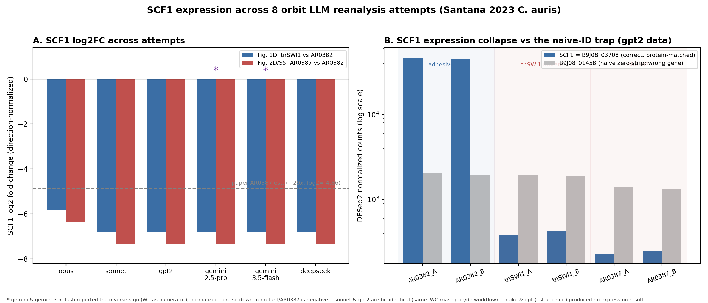

# Reanalyzing the Same Dataset with Eight Frontier Models: An Orbit Capability and Tooling Report

**Date:** 2026-06-08
**Subject:** Eight Loom *orbit* analyses (`/Users/anton/.loom/analyses/orbit_llm_tests/`), each a different frontier model driven to reanalyze the same RNA-seq dataset — Santana et al. 2023 *Science* (*Candida auris* SCF1 adhesin; BioProject `PRJNA904261`).
**Goal:** (1) compare how the models did; (2) mine all runs for shortcomings of **orbit** (the Loom harness), **Galaxy** (platform), the **Galaxy MCP** server, and the **BRC-analytics MCP** server; (3) propose actionable new skills and MCP changes.

## Method

We deep-read each run's `notebook.md` (polished narrative) and `activity.jsonl` (ground-truth turn-by-turn event log: `user.prompt`, `tool.start`/`tool.end`, `guard.decision`) plus produced artifacts, then synthesized across runs. Findings are evidence-grounded: every shortcoming carries a verbatim quote from a raw log or notebook, and every recommendation cites a real tool/repo path from the `github.com/galaxyproject` source (`galaxy-mcp`, `brc-analytics`, `galaxy-skills`). A key methodological caveat shaped the extraction: the Galaxy/BRC MCP servers report most logical failures with `isError=false` and the error buried in the result payload, so failures were found by scanning result text, not error flags — a finding that recurs as a top recommendation below.

The scientific ground truth used to score correctness: the paper's v2 6-digit locus tags were silently re-numbered in the current B8441 v3 assembly, so the naive zero-strip guess (`B9J08_001458` → `B9J08_01458`) maps SCF1 to the wrong gene and yields a false-negative; the correct mapping is `B9J08_001458` → v3 `B9J08_03708` via protein reciprocal-best-hit, with SCF1 strongly down (log2FC ≈ −6.8 to −7.4) in both contrasts.

---

## 1. Executive summary

We tested eight LLM "orbit" runs, each tasked with independently reanalyzing the same *Candida auris* RNA-seq dataset from Santana et al. 2023 (`PRJNA904261`, 6 paired-end samples) and reproducing two `DESeq2` contrasts—tnSWI1 vs AR0382 and AR0387 vs AR0382—on the current B8441 v3 assembly (`GCA_002759435.3`), culminating in a Fig. 1D-analog volcano plot with SCF1 highlighted. The central scientific trap is gene-ID bridging: the paper uses v2 6-digit locus tags that v3 silently re-numbered, so the naive zero-strip guess (`B9J08_001458` → `B9J08_01458`) maps SCF1 to the wrong gene and produces a false-negative "not differentially expressed" result; the correct path is protein-level DIAMOND reciprocal-best-hit, yielding `B9J08_03708`. Six of eight runs completed and reproduced the SCF1 collapse (log2FC ≈ −6.8 to −7.4, padj ≈ 0); two—`gpt` (1st attempt) and `claude-haiku-4-5`—aborted at data preparation before any analysis. The dominant tooling lesson cuts across every run: the Galaxy MCP wraps HTTP 4xx/5xx and connection-drop failures in `isError=false` text payloads, forcing agents to detect failure by string-scanning rather than flag-checking, and the IWC `rnaseq-pe` workflow's unhandled optional `parameter_input` steps (the `ConnectedValue`/`fastp` exit-255 bug) plus the absence of any BRC protein-FASTA/ID-mapping affordance recur as the highest-leverage friction points.

| Model | Outcome | SCF1 verdict | Deliverables | Cost | Turns | Tool calls | Errors |
|---|---|---|---|---|---|---|---|
| `claude-opus-4-7` | Completed; both contrasts reproduced | Reproduced; `B9J08_03708` via DIAMOND RBH (4,559 pairs) | Labeled volcano plots + PDF report | $131.83 (LLM+compute) | 23 | 169 | 7 |
| `claude-sonnet-4-6` | Completed; both contrasts reproduced | Reproduced; `B9J08_03708` via DIAMOND RBH | Volcano plots (PDF+PNG) + multi-page PDF | $24.87 (LLM+compute) | 20 | 165 | 16 |
| `gpt` (1st attempt) | Failed; stalled at data prep | None | None (history copy only) | unknown | 13 | 57 | 10 |
| `gpt2` (codex-mini) | Completed; both contrasts reproduced | Reproduced (after naive trap); `B9J08_03708` via DIAMOND RBH | 2 SVG + 2 PNG volcano plots + 3-page PDF | $23.46 (self-reported) | 27 | 191 | 11 |
| `gemini-2.5-pro` | Completed; both contrasts reproduced | Reproduced (sign inverted); `B9J08_03708` via local DIAMOND RBH | Text report + basic PDF; no volcano plot | $16.22 (LLM+compute) | 22 | 196 | 45 |
| `gemini-3.5-flash` | Completed; both contrasts reproduced | Reproduced (web-search mapping); `B9J08_03708` | 2 volcano plots + standalone PDF | $17.31 (LLM+compute) | 29 | 162 | 15 |
| `deepseek` | Completed; both contrasts reproduced | Reproduced (after brief trap); `B9J08_03708` via DIAMOND RBH | Notebook + HTML report + Galaxy page; no volcano, no PDF | $2.82 (compute only) | 23 | 157 | 28 |
| `claude-haiku-4-5` | Failed; aborted in ~3 min | None | None (empty history) | unknown | 3 | 9 | 3 |

### Cost vs quality

Cost is an explicit efficiency axis, but the reported figures mix two accounting bases and are not directly comparable: `claude-opus-4-7`, `claude-sonnet-4-6`, `gemini-2.5-pro`, and `gemini-3.5-flash` report LLM+compute; `deepseek` reports compute-only ($2.82, LLM API excluded); `gpt2` is a single self-reported number from its PDF. With that caveat, the spread is striking. `claude-opus-4-7` is the most thorough and complete run—correct, fully documented, labeled volcano PDFs—but at $131.83 it costs roughly 5× the next-most-expensive run and ~5 hours of wall time. The mid-tier `claude-sonnet-4-6` ($24.87) and `gpt2` ($23.46) reached comparably correct scientific endpoints at a fraction of opus's cost. `deepseek`'s $2.82 looks dramatically cheaper but understates true spend (no LLM cost) and shipped no volcano plot or PDF despite 10+ attempts. The takeaway: spending more bought completeness and polish (opus's labeled figures and final report), not scientific correctness—six runs converged on the same SCF1 result across a >40× nominal cost range, so the marginal dollars largely purchased deliverable quality and reduced human shepherding, not a better answer.

### Cross-attempt expression concordance

**Figure 1.** SCF1 expression results across the six completing attempts. **(A)** SCF1 log2 fold-change for both contrasts, direction-normalized so down-in-mutant / down-in-AR0387 is negative. All six attempts reproduce the SCF1 collapse and cluster tightly at log2FC ≈ −6.8 (Fig. 1D) and ≈ −7.35 (Fig. 2D/S5)—well beyond the paper's ~29× point estimate (dashed line). Two structural facts emerge: `sonnet` and `gpt2` are **bit-identical** (same `B9J08_03708`, baseMean, and log2FC to 12 significant figures) because both ran the unmodified IWC `rnaseq-pe`/`rnaseq-de` workflow with identical parameters on usegalaxy.org; and `opus` is mildly attenuated (−5.83 / −6.35) because it reported raw DESeq2 MLE estimates rather than shrunken values. `gemini-2.5-pro` and `gemini-3.5-flash` reported the inverse sign (WT as numerator); we normalized them here. `haiku` and `gpt` (1st attempt) produced no expression result and are absent. **(B)** The actual per-sample normalized counts (from `gpt2`) show why correctness hinged on the ID mapping: the correct SCF1 gene (`B9J08_03708`) collapses from ~46,000 counts in adhesive WT to ~400 in `tnSWI1` and ~240 in AR0387, whereas the naive zero-strip gene (`B9J08_01458`) stays flat (~1,300–2,000) across all conditions—exactly the false-negative that trapped `gpt2` and `deepseek` before they switched to protein matching.

Data source: full local DESeq2 tables (`sonnet/deseq2_*.tsv`, `gpt2/de_*_annotated.tsv`, `gpt2/protein_matched_key_gene_DE.tsv`) plus each run's notebook for attempts whose tables remain only in their Galaxy history (`opus`, `gemini`, `gemini-3.5-flash`, `deepseek`). Regenerate with `plot_scf1_across_attempts.py`.

## 2. Per-model deep-dive

### claude-opus-4-7

The most complete run in the suite. From a blank notebook the agent autonomously identified the six samples and their paper roles, built a paired HDCA, uploaded the v3 GTF and v2 protein FASTA, invoked the IWC `rnaseq-pe-main` workflow (after one failed attempt), merged `featureCounts`, ran both `DESeq2` contrasts, built a DIAMOND reciprocal-best-hit table of 4,559 orthologs, and produced labeled volcano PDFs plus a final PDF report. It solved the central trap correctly and explicitly: SCF1 → `B9J08_03708` (log2FC −5.83 tnSWI1, −6.35 AR0387; padj 0.023 and 0.0045), with the naive `B9J08_01458` guess flagged as wrong in the notebook. Efficiency was the weak point—23 turns, $131.83, ~5 hours, and two human rescues. Friction concentrated in four areas: the silent `fastp` exit-255 `ConnectedValue` failure from omitted optional adapter inputs (caught only when the user pointed it out); the Galaxy `volcanoplot` tool silently dropping SCF1 via `ggrepel` collision across 7 invocations before the agent fell back to local `matplotlib`+`adjustText`; a ~30-minute blocking `bash` poll loop that stalled on a JSON parse error; and both `loom-invocation` blocks left permanently `in_progress`. Secondary dead-ends included the `datasets_per_level` duplicate-`row.names` crash, `gffread -J` producing zero proteins, and conda missing from PATH.

### claude-sonnet-4-6

A complete, scientifically correct run at roughly one-fifth opus's cost ($24.87, 20 turns). The agent organized the 12 FASTQ files into a `list:paired` collection, ran the IWC `rnaseq-pe` and `rnaseq-de` workflows, performed DIAMOND protein RBH locally, and produced volcano plots (PDF+PNG) plus a multi-page PDF—all in a single 3-hour session. SCF1 mapped to `B9J08_03708` (log2FC −6.82 and −7.35, padj ≈ 0), and SWI1, IFF4109, BCY1 were all correctly resolved; an intermediate parse script briefly inverted the RBH direction and showed "SCF1 NOT FOUND" before a corrected script recovered it 90 seconds later. Despite correctness, the run logged 16 errors and four major friction clusters: a 41-minute dead period where two `fetch_content` calls hung and the session restarted, forcing the user to repeat a question verbatim; silent Galaxy MCP connection drops (`Failed to call tool: Not connected` with `isError=false`) requiring fallback to raw `curl`; the same `fastp` `ConnectedValue` bug needing three human interventions referencing galaxy-skills PR #20; and an unnecessary genome FASTA upload because no tool exposed whether a pre-built STAR index existed. Both `loom-invocation` blocks again ended `in_progress`.

### gpt (1st attempt)

A near-total failure at the scaffolding layer—42 minutes across 8 session restarts, never advancing past history preparation. The agent created the working history and copied 12 FASTQ datasets one-by-one via `curl` (the `/api/histories/{id}/copy` route returned 404 and no copy-history MCP tool exists), then spent the rest of the run failing to extract strandedness from the supplement: Cloudflare blocked the Science.org PDF (403), `pdftotext` and `PyPDF2` were absent, and `brc_analytics_search_ena_keywords` rejected the SRR accession with HTTP 400. No alignment, counting, `DESeq2`, v3 retrieval, or gene mapping was ever attempted, so SCF1 was never examined. The dominant failures were reliability-level: five orphaned `tool.start` events from mid-call crashes, a raw `context_length_exceeded` error surfaced to the user instead of being handled, repeated `galaxy_connect` re-authentication across restarts, and `galaxy_get_histories` masking a connection-closed error as `isError=false`. IWC workflow search returned zero bulk RNA-seq results, offering only single-cell options.

### gpt2 (OpenAI codex-mini)

One of the most complete runs: both contrasts executed, protein-level ID reconciliation performed, labeled volcano plots and a 3-page PDF produced over 27 turns and 191 tool calls. It fell squarely into the naive-mapping trap first—mapping `B9J08_001458` → `B9J08_01458` by stripping a leading zero, concluding SCF1 was not DE (log2FC −0.036, padj 0.83)—and required two explicit human prompts to escape: first to attempt protein matching (biopython Smith-Waterman 5-mer screen), then to use DIAMOND RBH, which confirmed `B9J08_03708` at 100% identity/coverage and the corrected log2FC of −6.82 and −7.35. The main tooling friction was Galaxy `invoke_workflow` parameter serialization: undocumented and unvalidated, the agent cycled through three wrong formats (`params` dict, `{parameter_value:...}` wrapper, `{input:...}` dict) before bare scalars worked, and one bad invocation reached Galaxy and failed at runtime. All HTTP 400s surfaced as `isError=false` text. The BRC organism search returned zero for "Candida auris" (only "Candidozyma auris" worked), all four `loom-invocation` blocks stuck `in_progress`, and the empty conda env required a manual DIAMOND binary download.

### gemini-2.5-pro

A scientifically correct end-to-end replication ($16.22, 22 turns) but the roughest path of any completing run—45 error events. SCF1 mapped to `B9J08_03708` and IFF4109 to `B9J08_04863` via local DIAMOND RBH; the contrast was defined with adhesive AR0382 as numerator, so log2FC reads +7.34 and +6.81 (sign inverted vs ground truth, magnitude matching, biological conclusion correct). The first RBH parse failed because it searched locus tags in the wrong column—the v2 proteome uses `PIS*` accessions as headers—until a corrected script matched the TITLE field. Four workflow invocations were needed before success: the empty-`fastp`-params failure, a wrong-strandedness cancellation, a STAR exit-104 from a gzip-compressed GTF supplied by `brc_analytics_resolve_workflow_inputs`, then success. The agent then stalled ~90 minutes after a `urllib` Traceback, requiring three re-prompts across two restarts. The boolean "Generate additional QC reports" parameter could not be serialized via the MCP and took 7 failed attempts before raw `curl` with an integer-keyed block. DESeq2 hit both the "groups requires a value" and duplicate-`row.names` errors. No volcano plot was produced—only a text report and basic PDF—and all four tracking blocks stayed `in_progress` into the next day.

### gemini-3.5-flash

Achieved the full scientific goal—both contrasts, SCF1 = `B9J08_03708` (log2FC +7.35 and −6.82, padj ≈ 0), two volcano plots, and a standalone PDF—but required 29 human turns over 4h17m, roughly double a smooth run. The most consequential shortcoming was Galaxy invocation tracking: `galaxy_invocation_check_all` returned `jobSummary` all-zeros across all nine calls regardless of state (ready, scheduled, completed), so the agent could not distinguish not-started from running and abandoned polling, producing a 35-minute stall broken only by the human saying "count table is ready." `galaxy_download_dataset` dropped the connection after an 8-minute idle gap. Critically, the v2→v3 mapping was solved by a methodologically weak path: a web search using the v3 IDs already in the output surfaced a bioRxiv preprint stating the `B9J08_001458` → `B9J08_03708` mapping, which the agent adopted without independent verification—the robust GTF `old_locus_tag` parse or protein BLAST was never completed. The orbit harness also produced a ~2-hour unexplained gap where the agent finished a summary and simply stopped, plus three notebook edit failures forcing a full rewrite.

### deepseek

One of the most complete pipelines—all nine planned steps executed—at the lowest reported figure ($2.82, compute-only, LLM API excluded). SCF1 correctly mapped to `B9J08_03708` via reciprocal DIAMOND BLASTP at 100% identity (`PIS56912.1` ↔ `KAK8440600.1`), with log2FC −7.35 and −6.82, padj ≈ 0; IFF4109 → `B9J08_04863` and SWI1 → `B9J08_01319` also correct, and strandedness was reverse (`-s 2`). The agent briefly hit the naive trap—found `B9J08_001458` absent from the v3 GTF (20:44), then stalled ~10 minutes with no tool call until the user said "try again," and only ran rigorous DIAMOND after explicit instruction at 21:01. The most damaging tooling failure was the first `rnaseq-pe` invocation silently failing (`when_not_boolean`: a boolean serialized as a string) with `isError=false` and zero jobs, discovered only ~40 minutes later via polling. `__BUILD_LIST__` returned HTTP 400 four times under `isError=false`, forcing a raw-API fallback through 6+ payload errors. PDF generation failed across 10+ attempts (`weasyprint` GTK missing, `tectonic` dyld mismatch, `fpdf2` Unicode crash, `cupsfilter` no filter), ending with an HTML file and a "Cmd+P" instruction instead of a PDF, and no local volcano plot was produced.

### claude-haiku-4-5

The shortest run—aborted in ~2.5 minutes (3 turns, 9 tool calls) at the history-copy step, before any bioinformatics. The agent correctly located `Santana_data`, recognized no `galaxy_copy_history` MCP tool exists, created an empty target history, and attempted to populate it via raw `curl`. The first loop reported all 12 datasets "copied" but `galaxy_get_history_contents` returned count=0—a silent false success; the second loop failed all 12; and the final recovery used `timeout`, which does not exist on macOS zsh. The agent then asked the user to copy datasets manually via the Galaxy UI and ended with an empty notebook—no plan, findings, or next step written. SCF1 was never referenced. The core bottleneck is the same `galaxy_mcp` gap that derailed `gpt`'s first attempt—no copy-history/copy-dataset primitive—compounded by the harness offering no recovery scaffold when the session ended blank.

## 3. Shortcomings of orbit (the Loom harness)

The orbit harness is the single highest-frequency failure source: every completed run ended with stale tracking blocks, and four runs lost 30 minutes to 2 hours to non-terminating waits or silent stalls. We rank issues by frequency across runs times severity.

### 3.1 loom-invocation blocks never reach a terminal state (5/8 runs, high)

The most universal defect. Every completed run that tracked workflow invocations left them frozen at `status: in_progress` long after the workflows finished or failed, corrupting the provenance record and misleading any resumed session.

- opus: "both loom-invocation blocks end with 'status: in_progress ... last_polled_at: 2026-06-02T19:30:02.786Z' ... never called again after workflow completed."
- gpt2: "all four loom-invocation blocks show status: in_progress, completed_steps: 0, total_jobs: 0; session ended at 18:56 but rnaseq-pe run completed ~15:35."
- gemini-2.5-pro: invocation `5b7345` "still reads in_progress at next-day poll (2026-06-04T13:08)" despite producing the count tables used downstream.

The harness polls via bash sleep loops or sparse `galaxy_invocation_check_one` calls and never reconciles the notebook block when terminal state arrives.

### 3.2 Blocking bash poll loops and multi-hour silent stalls (5/8 runs, high)

The agent's only wait primitive is a blocking bash `sleep` loop, which either times out, hangs on a parse error, or the agent simply abandons—then sits idle with no harness re-nudge.

- opus: a poll loop ran "16:35:28 to 17:05:01 (29.6 min later): 'Traceback ... json.JSONDecodeError'"—never exited.
- gemini-2.5-pro: after a urllib Traceback at 21:05 the agent stalled "1h14min gap with three re-prompts" before resuming.
- gemini-3.5-flash: "Nearly 2-hour unexplained gap (15:11:59 to 17:09:10) where agent issued a text summary and made no further tool calls. Harness logged no errors."
- deepseek: "No tool calls for 9m44s gap" after hitting the naive-mapping dead end; user had to say "try again."

The harness provides no autonomous re-poll, no timeout alert, and no self-resume when the agent goes quiet.

### 3.3 Session crashes / context overflow surface as raw errors with lost state (3/8 runs, high)

Session compaction, context-window overflow, and mid-tool-call crashes discard in-progress results and force the user to repeat questions verbatim.

- gpt (1st): "'Codex error: ... context_length_exceeded' ... surfaced as a raw JSON error string to the user instead of being handled by the harness; the model produced no assistant response." Five `fetch_content` tool.starts crashed with no tool.end.
- sonnet: "41-minute dead period (19:36:27 to 20:17:43) ... user had to repeat the strandedness+reference question verbatim."
- gpt (1st): galaxy_connect called three times in five minutes because "the bootstrap prompt does not persist connection state across session restarts."

### 3.4 Empty per-analysis conda env; conda not on PATH (5/8 runs, medium)

The `.loom/env/` environment does not exist at session start, ships no bioinformatics packages, and conda/mamba are absent from PATH—forcing heuristic path probing and repeated install failures before any local work (DIAMOND, biopython, PDF) can begin.

- opus: "conda: command not found ... Agent then ran: 'for p in $HOME/miniconda3/bin/mamba ...'" probing eight install paths.
- gpt2: "used because conda/mamba were not available in the shell. Attempted package: parasail failed to build."
- deepseek: "EnvironmentLocationNotFound: Not a conda environment ... Env created at 18:06:50."
- gpt (1st): missing pdftotext, PyPDF2, bioblend, requests all blocked progress.

### 3.5 No PDF-generation affordance (2/8 runs, medium)

The harness offers no path to PDF; runs that lacked a working toolchain burned long tails chasing native renderers.

- deepseek: "10+ PDF generation attempts all failed: weasyprint (GTK/Pango missing), tectonic (dyld libicuuc.78 missing), fpdf2 (Unicode em-dash crash) ... ended with 'open in browser + Cmd+P'."

### 3.6 exec-guard blocks the natural `curl | python3` JSON-consume pattern (1/8 runs, medium)

- opus: "guard.decision ... decision:deny ... reason:'pipe remote content to an interpreter'" fired twice on `curl ... | python3 -c ...` for Galaxy API JSON, forcing a two-step file pattern that itself introduced the JSON parse failure of 3.2.

### 3.7 Brittle notebook.md exact-string editing (1/8 runs, medium)

- gemini-3.5-flash: "Could not find the exact text in notebook.md ... repeated at 14:52:34 and 14:59:38," forcing a full-notebook rewrite that disrupted the tracking blocks.

### 3.8 macOS environment assumed to be Linux (1/8 runs, medium)

- haiku: "/bin/bash: line 7: timeout: command not found"—the agent assumed GNU coreutils, blocking its last recovery attempt.

### 3.9 Vacuous bootstrap exchange on empty notebook (1/8 runs, medium)

- haiku: the bootstrap prompt asks "What do you want to work on next?" but with an empty notebook the agent replied "Notebook is empty -- what do you want to work on next?", wasting the opening turn instead of injecting the task.

---

## 4. Shortcomings of Galaxy (the platform)

Galaxy-platform failures cluster around the IWC `rnaseq-pe` workflow's input handling and DESeq2's intolerance of duplicate dataset names—both of which crash at job runtime with no upfront validation.

### 4.1 Optional `parameter_input` steps crash fastp at exit 255 (4/8 runs, high) — FIXED UPSTREAM

The dominant Galaxy failure. The IWC `rnaseq-pe` workflow marks the fastp adapter inputs (steps 1, 2) optional, but if omitted the scheduler passes a literal `ConnectedValue` Python object to the fastp command line. The invocation returns `state: ready` with no validation error; the failure surfaces only as fastp exit 255 in job details. This was documented as a client-side workaround in galaxy-skills PR #20.

> **Resolved at the platform level.** Galaxy [PR #22820](https://github.com/galaxyproject/galaxy/pull/22820) — "Fix ConnectedValue leak for omitted optional inputs inside groups" — was **merged into Galaxy 26.0 on 2026-06-04 12:48 UTC**, mid-way through this run series. The fix propagates `replace_optional_connections` through `visit_input_values` recursion so nested optional connections resolve to the tool parameter's own default instead of leaking the `ConnectedValue` sentinel into the command line. These runs (2026-06-02 to 06-04) hit the bug because the fix was not yet deployed to usegalaxy.org. Once 26.0 is live, the client-side "explicitly fill empty params" workaround (galaxy-skills PR #20, Spec A2 below) becomes obsolete for the leak itself, though explicit-value hygiene for booleans remains useful.

- opus: "exit_code:255 for fastp ... User had to prompt: 'I think it has to do with empty parameter fields'."
- sonnet: "the workflow scheduler leaves the downstream tool connected slot as an unresolved ConnectedValue Python object reference"; required three human interventions pointing to PR #20.
- gpt2: "input step 9590583 (Generate additional QC reports) is not optional and no input provided."
- gemini-2.5-pro: first invocation "failed - Text reformatting paused due to empty fastp params."

### 4.2 DESeq2 fails with "duplicate row.names" when count files share a name (3/8 runs, medium)

DESeq2's `datasets_per_level` mode uses the Galaxy dataset name as the row key. All six per-sample featureCounts outputs default to the name "Counts Table," so DESeq2 crashes—with no upfront validation, only an R traceback in stderr.

- opus: "duplicate 'row.names' are not allowed ... non-unique value when setting 'row.names': 'Counts Table'."
- gemini-2.5-pro: "Agent had to rename each element individually before DESeq2 would accept them."

### 4.3 DESeq2 `groups` parameter cannot resolve collection-element IDs via the API (1/8 runs, medium)

- gemini-2.5-pro: "Parameter groups: requires a value, but no legal values defined (err_code 400008)," forcing a fallback to raw curl with form-encoded dataset IDs.

### 4.4 STAR fails (exit 104) on a gzip-compressed GTF (1/8 runs, high)

The BRC-resolved GTF URL is a `.gtf.gz`, which STAR cannot read; the only feedback is `state: error` with no compression diagnostic.

- gemini-2.5-pro: "Warning: The file Type was set to gtf but the file does not appear to be of that type"—STAR exit 104 took ~30 tool calls to diagnose.

### 4.5 No discoverable pre-built STAR index signal (2/8 runs, medium)

Galaxy ships a STAR index for this genome, but nothing surfaces it; agents uploaded a redundant FASTA until corrected.

- sonnet: user.prompt "STAR does have index for thsi genome!" after the agent had already uploaded the FASTA and submitted an invocation.

### 4.6 `gffread -J` silently emits zero proteins from a valid GTF (1/8 runs, low)

- opus: gffread with `-J` "succeeded (isError=False)" but produced "0" sequences from a valid 5,424-gene GTF; the agent re-ran without `-J` to recover all 5,424.

---

## 5. Shortcomings of the Galaxy MCP server

The Galaxy MCP server's defining flaw is that it reports HTTP 4xx/5xx and connection failures as `isError=false` text payloads—forcing the agent to detect failure by scanning strings, and silently submitting invalid invocations that crash hours later.

### 5.1 Errors surfaced as `isError=false` text, not the error flag (6/8 runs, high)

The most consequential MCP defect. `invoke_workflow`, `run_tool`, and others wrap HTTP 400/500 and "Connection closed" responses in a success-shaped payload with the error embedded as text. The agent cannot distinguish failure from empty result, so it loops or proceeds on bad data.

- gpt2: "isError=False: resultSummary starts Error: Error calling tool invoke_workflow: ... 400: Input should be a valid dictionary."
- deepseek: "isError=False: 'Error: ... 400: Required parameter(s) kwd not provided'. Repeated at 18:04:07, 18:05:27, 18:10:28."
- gemini-2.5-pro: "isError=False: ... 400: {err_msg: Wrong id ... unable to decode."
- gpt (1st): "galaxy_get_histories ... isError=False: 'Failed to call tool: MCP error -32000: Connection closed' ... the connection failure is reported as content text, not as isError=true."

### 5.2 Undocumented, unvalidated workflow-parameter serialization (4/8 runs, high)

`invoke_workflow` has no client-side schema validation and an undocumented format. Agents cycled through `{params: ...}`, `{parameter_value: ...}`, and `{input: ...}` wrappers; booleans-as-strings reached Galaxy and crashed at runtime.

- gpt2: "tried three wrong formats before finding the working one ... {1: {parameter_value: ''}} which Galaxy accepted but caused runtime failure."
- gemini-2.5-pro: the boolean "Generate additional QC reports" param "required 7 failed attempts before the agent resorted to raw curl with the correct integer-indexed JSON body."
- deepseek: "galaxy_invoke_workflow serialized boolean parameters as JSON strings — the invocation returned success, launched zero jobs," discovered only 40 minutes later via polling.

### 5.3 MCP connection silently drops mid-session with no auto-reconnect (3/8 runs, high)

After a session restart or idle gap, `galaxy_*` tools return `"Failed to call tool: Not connected"` (with `isError=false`), and `galaxy_connect` itself returns the same—forcing manual retries and curl fallbacks.

- sonnet: "galaxy_invoke_workflow resultSummary: Failed to call tool: Not connected; then [20:49:12][20:49:18][20:49:22] galaxy_connect all return same."
- gemini-3.5-flash: "galaxy_download_dataset ... 'Failed to call tool: Not connected'" after an 8-minute idle gap.

### 5.4 Invocation status check returns all-zero `jobSummary` and no error detail (3/8 runs, high)

`get_invocations` / `check_all` report `jobSummary` as all-zeros regardless of actual state (running, completed, or failed) and omit the failed-job stderr—so the agent can neither track progress nor diagnose failures.

- gemini-3.5-flash: "state=ready jobSummary={ok:0, running:0, queued:0...} and ... state=completed jobSummary={ok:0...} - zeros even when completed," causing a 35-minute premature-abandonment stall.
- sonnet: "invocationState: failed, jobSummary: ok=0 ... no stderr or error message from the failed fastp job."
- opus: "invocationState: failed, jobSummary: {ok: 0}" with no diagnostic for the fastp exit-255 cause.

### 5.5 No history/dataset copy primitive (4/8 runs, high)

No `copy_history` or `copy_dataset` MCP tool exists; agents hand-roll curl loops against `/api/histories/{id}/copy` (which 404s) and copy 12 datasets individually—two runs stalled out entirely here.

- haiku: copy loop "reported success checkmarks for all 12 datasets but the datasets were never actually added; galaxy_get_history_contents confirmed count=0"—the run aborted at this step.
- gpt (1st): "/api/histories/{id}/copy returned a 404 ... individually POSTing each of 12 datasets via /contents/datasets."
- gpt2, sonnet: same gap, both fell back to bash curl.

### 5.6 `get_tool_input_template` unusable when disconnected (1/8 runs, medium)

- sonnet: "galaxy_get_tool_input_template isError=False resultSummary: Failed to call tool: Not connected; agent then made 8 successive bash curl calls to /api/tools/.../build to reconstruct the schema manually."

### 5.7 IWC workflow search misses bulk RNA-seq (1/8 runs, medium)

- gpt (1st): "Found 0 IWC workflows matching RNA-seq Candida differential expression"; a generic "RNA-seq" query "returned only scRNA-seq 10x workflows," blocking discovery of the STAR+featureCounts+DESeq2 path entirely.

### 5.8 Volcanoplot silently drops colliding forced labels (1/8 runs, high)

- opus: "Galaxy volcanoplot silently dropped SCF1 due to ggrepel collision in the dense bottom-left region"—called 7 times across 3 rounds before the user said "do this locally." (Borderline platform/MCP; the MCP wrapper offers no post-run label verification.)

### 5.9 `notebook_push_to_galaxy` omits required `slug` from its schema (1/8 runs, medium)

- deepseek: "isError=False: 'Error: Galaxy API 400: {err_msg: Field required in (body, slug)'. Fixed by adding slug on retry."

---

## 6. Shortcomings of the BRC MCP server

**Repo confirmed:** "BRC MCP" = the MCP server inside [`galaxyproject/brc-analytics`](https://github.com/galaxyproject/brc-analytics), defined at `backend/api/app/services/mcp_server.py` (`create_mcp_server(catalog_data, ena_service)`, FastMCP-based; 9 catalog tools + 2 ENA-search tools, with the same catalog logic also exposed non-MCP at `backend/api/app/services/tools/catalog_tools.py`). All specs below target that file.

The BRC server's central gap is scientific, not cosmetic: it exposes no protein FASTA or v2↔v3 locus-tag mapping, so the analysis trap at the heart of every run (SCF1's renumbered ID) gets no tooling support. Secondary issues are brittle ENA search and species-synonym handling.

### 6.1 No protein FASTA or v2↔v3 gene-ID mapping affordance (6/8 runs, high)

The single most important BRC gap. Assembly records expose only `geneModelUrl` and `ucscBrowserUrl`—no `proteinFaUrl`, no ID cross-reference. Every run that solved the central trap had to manually browse NCBI FTP, download both proteomes, install DIAMOND, and write RBH scripts; two runs (gpt2, deepseek) needed explicit human prompting to even start, and weaker models (gemini-3.5-flash) resolved it only by a "lucky web search hit."

- opus: "brc_analytics_get_assemblies response ... shows only geneModelUrl and ucscBrowserUrl fields -- no proteinFaUrl. Agent resorted to ... manually constructed URL: '...GCA_002759435.2_..._protein.faa.gz'."
- gpt2: human prompt "you cannot reproduce downregulation because gene names don't match. You need to do protein matching."
- gemini-3.5-flash: "Agent relying on lucky web search hits to confirm gene ID version mappings instead of authoritative GTF-based verification."

### 6.2 `search_ena_keywords` returns HTTP 400 on accession / BioProject queries (4/8 runs, medium)

The tool routes SRR run accessions and PRJNA BioProject IDs into a free-keyword `result=read_run` query that ENA rejects, with no fallback to NCBI SRA.

- sonnet: "ENA keyword search failed: ... Client error 400 for url ...query=SRR22376027 AND scientific_name%3DCandida+auris..."
- gpt (1st): "Client error 400 ... query=SRR22376027" — assembly/annotation discovery via BRC was never reached.
- gemini-3.5-flash: "Client error 400 for url ...query=PRJNA904261" — does not accept BioProject IDs.

### 6.3 `search_organisms` does not handle the old species name "Candida auris" (3/8 runs, medium)

After reclassification the catalog indexes only *Candidozyma auris*; "Candida auris" returns `count=0` with no synonym redirect, while assembly lookup by accession still succeeds—a confusing split.

- gpt2: "args={query: Candida auris} returned {count:0,organisms:[]}; re-query with Candidozyma auris returned count=1."
- deepseek: "search_organisms ... '{count:0,organisms:[]}'. Assembly lookup succeeded ... search and lookup use different ontologies/indices."

### 6.4 No pre-built STAR index discovery affordance (2/8 runs, medium)

- sonnet: "BRC MCP has no tool to check whether a given genome accession has a pre-built STAR index on usegalaxy.org; agent uploaded FASTA assuming no index, wasting time until the human corrected it."

### 6.5 `resolve_workflow_inputs` returns errors as `isError=false` and resolves a compressed GTF (2/8 runs, medium)

- deepseek: "isError=False: 'Error: ... resolve_workflow_inputs: Workflow #workflow/github.com/iwc-workflows/rnaseq-pe/main not found'"—a silent dead end.
- gemini-2.5-pro: the resolved GTF was "a compressed .gtf.gz URL from the UCSC hub," which then crashed STAR (see 4.4).

---

## 7. Recommendations (actionable specs)

We prioritize specs that prevent the highest-frequency, highest-severity failures: the naive locus-tag ID trap (6 runs), the fastp empty-param crash (4 runs), boolean/parameter string typing (4 runs), invisible MCP errors (6 runs), never-terminating invocation polling (5 runs), and the missing v2↔v3 protein-mapping affordance in BRC (6 runs).

### (a) New/updated skills

**Spec A1 — Extend `galaxy-integration/mcp-reference/gotchas.md` with a cross-assembly gene-ID mapping skill.**
- Where: galaxy-skills repo; currently no skill covers DESeq2, DIAMOND RBH, or volcano plotting (confirmed gap in recon).
- What: New sub-skill `cross-assembly-id-mapping` with a NEVER/ALWAYS checklist ("NEVER zero-strip/zero-pad v2 locus tags; v3 re-numbered them") and a worked DIAMOND reciprocal-best-hit recipe (download both proteomes, `diamond makedb`, blastp both directions, parse locus tags from the FASTA TITLE field, not the column).
- Prevents: the central trap. gpt2 fell in (naive B9J08_01458, "log2FC -0.036, padj 0.83") and needed two human prompts; gemini-3.5-flash got the answer only by "lucky web search hit"; gemini-2.5-pro's first parse "returned Empty DataFrame ... V2 proteome uses PIS* protein accession IDs."
- Touches: `galaxy-skills/galaxy-integration/` (new sub-skill, mirror in `AGENTS.md` router).

**Spec A2 — Re-scope the `galaxy-skills` PR #20 gotcha now that the leak is fixed upstream.**
- Status: the underlying fastp `ConnectedValue` leak is **fixed by Galaxy PR #22820 (merged 26.0, 2026-06-04)** — see §4.1. Once usegalaxy.org runs 26.0, the "explicitly fill empty text adapters" half of PR #20 is obsolete and should be retired to avoid teaching a stale workaround.
- Where: `galaxy-integration/mcp-reference/gotchas.md` (PR #20 added the fastp-adapter case for inputs 1/2).
- What: Replace the obsolete text-adapter workaround with a version-aware note ("fixed in Galaxy ≥26.0; only needed on older servers"), and keep/generalize the still-relevant half: non-optional booleans like "Generate additional QC reports" must receive an explicit, correctly-typed value (integer-keyed JSON boolean), with a verify-via-`get_workflow_details` step.
- Prevents: stale-advice drift, plus the boolean-param 7-retry loop (gemini-2.5-pro: "input step 9591293 ... not optional and no input provided").
- Touches: `galaxy-skills/galaxy-integration/mcp-reference/gotchas.md` (rewrite).

**Spec A3 — New skill `local-env-bootstrap`.**
- Where: galaxy-skills; the `.loom/env` setup is currently undocumented.
- What: A `setup_local_python` snippet that probes common conda paths, creates `.loom/env` if absent, pre-declares DIAMOND/biopython/matplotlib/adjustText, and uses a portable HTML→PDF path (e.g. headless Chrome) instead of weasyprint/tectonic. Note macOS lacks `timeout`/GNU coreutils.
- Prevents: opus's 8-path conda probe; deepseek's "10+ PDF generation attempts all failed"; haiku's "timeout: command not found."
- Touches: `galaxy-skills` (new skill).

### (b) Galaxy MCP changes

**Spec B1 — Set `isError=true` on all 4xx/5xx and connection failures.**
- Where: `invoke_workflow`, `run_tool`, `resolve_workflow_inputs`, all `galaxy_*` tools (`server.py`).
- What: Return HTTP 4xx/5xx and "Connection closed"/"Not connected" with `isError=true` and the parsed `err_msg`, not embedded in a success payload.
- Prevents: the 6-run text-scanning defect—gpt2 ("isError=False: ... 400: Input should be a valid dictionary"), deepseek (4 silent `__BUILD_LIST__` loops), gpt-1st ("MCP error -32000: Connection closed ... reported as content text").
- Touches: galaxy-mcp `mcp-server-galaxy-py/src/galaxy_mcp/server.py`.

**Spec B2 — Pre-flight `invoke_workflow` parameter validation.**
- Where: `invoke_workflow` (galaxy-mcp `server.py`).
- What: Before POSTing, introspect each `parameter_input` step from `get_workflow_details`; raise a user-visible error listing any unresolved `ConnectedValue` slots and any boolean param supplied as a string; auto-coerce documented serializations (bare scalar in `inputs`, integer-keyed booleans).
- Prevents: fastp ConnectedValue crashes (4 runs) and the boolean-string trap—deepseek ("serialized boolean parameters as JSON strings ... launched zero jobs"), gpt2's 4-format retry loop.
- Touches: galaxy-mcp `invoke_workflow`.

**Spec B3 — New `galaxy_invocation_wait` tool.**
- Where: galaxy-mcp (new tool wrapping `get_invocations`).
- What: Poll invocation status with exponential backoff and configurable timeout; on terminal state, return real per-job counts (resolving step→job_id) and any failed-job stderr, and emit a machine-readable `loom-invocation-update` payload the harness consumes to reconcile notebook blocks atomically.
- Prevents: (i) the 5-run stale `in_progress` blocks; (ii) the 5-run blocking bash poll loops (opus's 29.6-min JSONDecodeError loop, gemini-3.5-flash's 35-min stall on all-zero `jobSummary`); (iii) hidden failed-job causes (sonnet, opus: "no stderr or error message from the failed fastp job").
- Touches: galaxy-mcp (new tool) + orbit harness (consume the update event).

**Spec B4 — New `galaxy_copy_history` / `galaxy_copy_datasets` tools.**
- Where: galaxy-mcp; no copy primitive exists today.
- What: Wrap `POST /api/histories` (with `all_datasets=true`) and the dataset-copy endpoint; validate by re-reading target history count and surface any mismatch as `isError=true`.
- Prevents: the haiku abort ("reported success ... but ... count=0"), the gpt-1st 404 + 12 individual POSTs, and the gpt2/sonnet bash fallbacks.
- Touches: galaxy-mcp (new tools).

**Spec B5 — Auto-reconnect on "Not connected."**
- Where: all `galaxy_*` tools (galaxy-mcp).
- What: On "Not connected," silently reconnect with cached credentials and retry once before surfacing an error.
- Prevents: sonnet's 8 Not-connected failures + 3 manual reconnects; gemini-3.5-flash's `download_dataset` drop after idle.
- Touches: galaxy-mcp connection layer.

**Spec B6 — `volcanoplot` forced-label verification in the MCP wrapper.**
- Where: galaxy-mcp `run_tool` post-run hook for volcanoplot.
- What: When a label file is passed, verify each forced label is present in the output SVG/PNG; warn if ggrepel dropped any.
- Prevents: opus's 7-iteration silent SCF1-label drop.
- Touches: galaxy-mcp `run_tool`.

**Spec B7 — Add `slug` to `notebook_push_to_galaxy` schema.**
- Where: galaxy-mcp `notebook_push_to_galaxy`.
- What: Mark `slug` required in the MCP schema so callers fail validation before the API round-trip.
- Prevents: deepseek's "Field required in (body, slug)" 400.
- Touches: galaxy-mcp.

### (c) BRC MCP changes

**Spec C1 — Add `proteinFaUrl`/`cdsNucFaUrl` fields and a `map_gene_ids` tool.**
- Where: brc-analytics `backend/api/app/services/mcp_server.py` (and `catalog_tools.py`), extending `get_assemblies`/`get_assembly_details`; new `map_gene_ids(accession_v_old, accession_v_new, locus_tags)`.
- What: Expose protein FASTA download URLs alongside `geneModelUrl`; `map_gene_ids` returns v2↔v3 correspondences via a precomputed RBH table or NCBI protein cross-reference.
- Prevents: the 6-run central trap and all manual NCBI-FTP/DIAMOND scaffolding—opus ("no proteinFaUrl ... manually constructed URL"), gpt2/deepseek human-prompted RBH, gemini-2.5-pro's "~30 tool calls" proteome download.
- Touches: brc-analytics MCP server (extend `get_assemblies`, new `map_gene_ids`).

**Spec C2 — Route accession/BioProject inputs in `search_ena_keywords` and fall back to NCBI SRA.**
- Where: brc-analytics `search_ena_keywords` (and `search_ena`).
- What: Detect SRR run accessions → `run_accession` field and PRJNA → `study_accession` field instead of free-keyword `read_run` queries; on ENA 400, fall back to NCBI SRA.
- Prevents: the 4-run HTTP 400—sonnet ("Client error 400 ... query=SRR22376027"), gemini-3.5-flash ("query=PRJNA904261").
- Touches: brc-analytics MCP server.

**Spec C3 — Add species-synonym handling to `search_organisms`.**
- Where: brc-analytics `search_organisms`.
- What: Map deprecated names ("Candida auris" → *Candidozyma auris*) and unify the search index with the accession-lookup index.
- Prevents: gpt2/deepseek `count=0` dead ends ("re-query with Candidozyma auris returned count=1").
- Touches: brc-analytics MCP server.

**Spec C4 — Add `get_galaxy_indexes(accession)` and flag GTF compression in `resolve_workflow_inputs`.**
- Where: brc-analytics MCP server; new tool + fix to `resolve_workflow_inputs`.
- What: Report which usegalaxy.org servers hold a pre-built STAR index for an assembly; when resolving inputs, prefer an uncompressed GTF URL or flag that STAR requires decompression; return errors with `isError=true`.
- Prevents: the redundant-FASTA upload (sonnet "STAR does have index for this genome!") and the STAR exit-104 `.gtf.gz` crash (gemini-2.5-pro), plus the silent "Workflow not found" (deepseek).
- Touches: brc-analytics MCP server (new tool + `resolve_workflow_inputs` fix).
