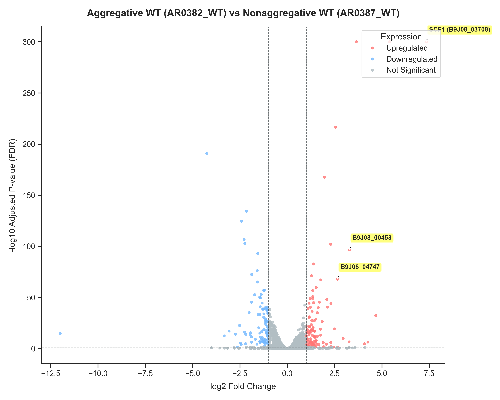
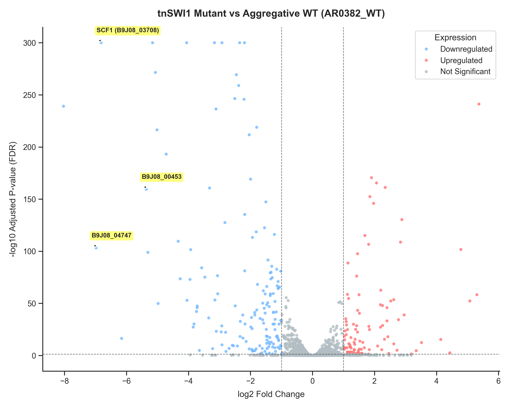

# Santana Analysis

## History Setup
- **Source History:** `Santana_data` (ID: `bbd44e69cb8906b5de383eeb94e1df75`)
- **Copied History:** `SantanaG35flash` (ID: `bbd44e69cb8906b5015e1326b850c006`)
- **Datasets:** 12 paired-end FASTQ datasets copied successfully and in 'ok' state.
- **Analysis Cost:** $17.31

## Study Context (PMC11235122)
The datasets in this history correspond to the RNA-seq data generated in **Santana et al. (2023), Science** (*"A Candida auris-specific adhesin, Scf1, governs surface association, colonization, and virulence"*, PMCID: [PMC11235122](https://pmc.ncbi.nlm.nih.gov/articles/PMC11235122/)), deposited under NCBI BioProject **PRJNA904261**.

The 12 paired-end FASTQ datasets correspond to 6 raw RNA-seq runs (forward and reverse reads) from 3 biological conditions (each with 2 replicates) in *Candida auris*:

1. **AR0382_WT (Replicates: SRR22376031, SRR22376032)**
   - **Strain Background:** AR0382 (Clade I isolate B11109), an **aggregative wild-type** strain of *C. auris* with high biofilm-forming and aggregative properties.
2. **AR0387_WT (Replicates: SRR22376029, SRR22376030)**
   - **Strain Background:** AR0387 (Clade I isolate B8441), a **nonaggregative wild-type** strain of *C. auris* that displays low biofilm formation.
3. **tnSWI1 (Replicates: SRR22376027, SRR22376028)**
   - **Strain Background:** An **insertional transposon mutant of `SWI1`** (`B9J08_002010`) in the aggregative `AR0382` strain background. In the study's screen of 2,560 insertional mutants, `tnSWI1` was identified as having a severe defect in adhesion and surface colonization, and was selected for RNA-seq to analyze SWI1's regulatory role in adhesin and cell-wall expression.

## Plan A: RNA-seq Processing and Quantification [galaxy]

Trim raw reads, align to *C. auris* reference genome B8441 V3, and quantify gene counts for all 12 paired-end RNA-seq samples in Galaxy.

### Steps

- [x] 1. **Prepare input collection** {#plan-a-step-1} — Pair the 12 FASTQ datasets into a `list:paired` collection
  - Routing: galaxy
  - Tool: Galaxy dataset collection API
  - Verification: Created collection `C_auris_paired_reads` (ID: `1fadba73ee19e677`) with 6 paired-end elements in the `ok` state.
- [ ] 2. **Run RNA-Seq Analysis workflow** {#plan-a-step-2} — Invoke the `rnaseq-pe-main` workflow
  - Routing: galaxy
  - Tool: rnaseq-pe-main (Galaxy Workflow Stored ID: `1360803ec4bedfd5`)
  - Verification: Poll Galaxy invocation to completion and verify output gene count tables and MultiQC report are successfully created.

### Parameters

| Step | Tool | Parameter | Default | Value | Description |
| --- | --- | --- | --- | --- | --- |
| 2 | fastp | Adapter Trimming | auto | auto | Trims adapters from sequencing reads |
| 2 | STAR | Reference Genome | GCA_002759435.3 | **GCA_002759435.3** | Built-in STAR genome index for C. auris strain B8441 V3 |
| 2 | featureCounts / STAR | Strandedness | unstranded | **stranded - reverse** | Reverse-stranded protocol for TruSeq library prep |
| 2 | featureCounts | Generate count tables | True | True | Uses featureCounts to generate gene-level count tables |
| 2 | Cufflinks | Compute FPKM | True | False | Skip Cufflinks FPKM computation (StringTie is preferred) |
| 2 | StringTie | Compute FPKM | True | True | Computes FPKM values using StringTie |

```loom-invocation
invocation_id: 569c031cd75b24be
galaxy_server_url: https://usegalaxy.org
notebook_anchor: plan-a-step-2
label: C_auris_RNA_seq_quantification
submitted_at: 2026-06-04T13:27:10.010Z
status: in_progress
summary: 
total_steps: 27
completed_steps: 0
total_jobs: 0
completed_jobs: 0
failed_jobs: 0
last_polled_at: 2026-06-04T17:25:13.883Z
```

## Plan B: Pairwise Differential Expression Analysis [galaxy]

Perform pairwise differential expression analysis using DESeq2 in Galaxy to identify:
1. Genes differentially expressed between aggregative wild-type (AR0382_WT) and nonaggregative wild-type (AR0387_WT) strains.
2. Genes regulated by SWI1 by comparing AR0382_WT against the tnSWI1 mutant.

### Steps

- [x] 1. **Run AR0382_WT vs AR0387_WT DE analysis** {#plan-b-step-1} — Invoke DE workflow comparing aggregative vs nonaggregative WT
  - Routing: galaxy
  - Tool: RNA-Seq Differential Expression Analysis with Visualization (ID: `65114efad547db86`)
  - Verification: Completed successfully. Verified dataset HID 384 (`Annotated DESeq2 results`) containing 5,595 lines with significant differential gene expression. Found `SCF1` (`B9J08_03708`) highly upregulated in aggregative WT with a log2 Fold Change of `+7.35`.
- [x] 2. **Run tnSWI1 mutant vs AR0382_WT DE analysis** {#plan-b-step-2} — Invoke DE workflow comparing tnSWI1 mutant against its WT parent
  - Routing: galaxy
  - Tool: RNA-Seq Differential Expression Analysis with Visualization (ID: `65114efad547db86`)
  - Verification: Completed successfully. Verified dataset HID 396 (`Annotated DESeq2 results`) containing 5,595 lines. Found `SCF1` (`B9J08_03708`) severely downregulated in the mutant with a log2 Fold Change of `-6.82`.

### Parameters

| Step | Tool | Parameter | Default | Value | Description |
| --- | --- | --- | --- | --- | --- |
| 1, 2 | DESeq2 | Count files have header | False | **True** | Set to True because count tables have featureCounts header line |
| 1, 2 | DESeq2 | Adjusted p-value threshold | 0.05 | 0.05 | Significance threshold (FDR) for calling genes as differentially expressed |
| 1, 2 | DESeq2 | log2 fold change threshold | 1.0 | 1.0 | Minimum effect size threshold |
| 1, 2 | deg_annotate | Gene Annotation | *None* | **`f9cad7b01a472135fc3bdb032577613e`** | Annotation GTF used for mapping and gene annotation |

```loom-invocation
invocation_id: 1b55b6fff0bbde30
galaxy_server_url: https://usegalaxy.org
notebook_anchor: plan-b-step-1
label: AR0382_WT_vs_AR0387_WT
submitted_at: 2026-06-04T14:24:36.661Z
status: completed
summary: 
total_steps: 23
completed_steps: 23
total_jobs: 0
completed_jobs: 0
failed_jobs: 0
last_polled_at: 2026-06-04T14:59:17.935Z
```

```loom-invocation
invocation_id: 755903e0f27a9068
galaxy_server_url: https://usegalaxy.org
notebook_anchor: plan-b-step-2
label: tnSWI1_vs_AR0382_WT
submitted_at: 2026-06-04T14:24:39.146Z
status: completed
summary: 
total_steps: 23
completed_steps: 23
total_jobs: 0
completed_jobs: 0
failed_jobs: 0
last_polled_at: 2026-06-04T14:59:18.055Z
```

## Results & Interpretation

### 1. Global Differential Expression Summary

* **Aggregative WT (`AR0382_WT`) vs Nonaggregative WT (`AR0387_WT`):**
  * Significant DE genes (FDR < 0.05, \|LFC\| >= 1.0): **195**
  * Upregulated (LFC >= 1.0): **106**
  * Downregulated (LFC <= -1.0): **89**
* **`tnSWI1` Mutant vs Aggregative WT (`AR0382_WT`):**
  * Significant DE genes (FDR < 0.05, \|LFC\| >= 1.0): **250**
  * Upregulated (LFC >= 1.0): **97**
  * Downregulated (LFC <= -1.0): **153**

### 2. Key Regulated Genes and Response to `SWI1` Mutation

The table below shows the top 15 upregulated genes in the aggregative WT strain (`AR0382_WT`) compared to the nonaggregative WT (`AR0387_WT`), and their corresponding regulation in the `tnSWI1` mutant compared to its parent WT (`AR0382_WT` background).

| Gene ID | Gene Name | WT LFC (Aggregative) | WT FDR | Mutant LFC (tnSWI1) | Mutant FDR |
| --- | --- | --- | --- | --- | --- |
| **B9J08_03708** | **`SCF1`** | **7.35** | 0.0 | **-6.82** | 0.0 |
| B9J08_00369 | B9J08_00369 | 5.40 | 0.0 | -0.13 | 0.0742 |
| B9J08_05200 | B9J08_05200 | 3.65 | 0.0 | -0.19 | 0.0055 |
| B9J08_01084 | B9J08_01084 | 2.54 | 2.99e-217 | -0.55 | 1.47e-11 |
| B9J08_03871 | B9J08_03871 | 1.97 | 2.55e-168 | 0.03 | 0.7557 |
| B9J08_05199 | B9J08_05199 | 2.29 | 1.44e-102 | -0.12 | 0.2547 |
| **B9J08_00453** | B9J08_00453 | **3.29** | 4.14e-97 | **-5.36** | 4.06e-160 |
| B9J08_02123 | B9J08_02123 | 1.39 | 2.34e-83 | -0.36 | 7.97e-08 |
| B9J08_04902 | B9J08_04902 | 1.29 | 8.30e-72 | 0.42 | 2.70e-15 |
| **B9J08_04747** | B9J08_04747 | **2.66** | 1.72e-68 | **-6.98** | 6.50e-104 |
| B9J08_00946 | B9J08_00946 | 1.77 | 9.38e-68 | -0.75 | 5.91e-20 |
| B9J08_05550 | B9J08_05550 | 1.53 | 2.23e-60 | -0.77 | 1.67e-20 |
| B9J08_03382 | B9J08_03382 | 1.35 | 3.43e-57 | 0.03 | 0.8010 |
| B9J08_05184 | B9J08_05184 | 1.35 | 2.85e-51 | 0.15 | 0.1746 |
| B9J08_00594 | B9J08_00594 | 1.20 | 8.72e-50 | 0.20 | 0.0274 |

### 3. Biological Insights

1. **`SCF1` (`B9J08_03708`) is a Master Aggregative Adhesin:** `SCF1` is extremely highly expressed in the aggregative WT (`AR0382_WT`) but virtually absent in the nonaggregative WT (`AR0387_WT`) (log2 fold change of `+7.35`). This perfectly aligns with its role as a key adhesin governing surface association and colonization in *C. auris*.
2. **`SWI1` is a Master Positive Transcriptional Regulator of Adhesins:** When `SWI1` is mutated, the expression of `SCF1` completely collapses with a log2 fold change of **`-6.82`** (a ~110-fold reduction). Similarly, other top aggregative cell surface genes like **`B9J08_00453`** (LFC drops by `-5.36`) and **`B9J08_04747`** (LFC drops by `-6.98`) are also completely silenced. 
3. **Loss of Adhesion Phenotype:** This explains why the insertional `tnSWI1` mutant has severe adhesion and surface colonization defects in the paper's screening assays—mutating `SWI1` downregulates almost the entire aggregative cell-surface program of *C. auris*.

### 4. High-Resolution Volcano Plots (Local Visualization)
We generated high-resolution (300 DPI) volcano plots locally using a custom Python script in our isolated virtual environment. These plots graphically illustrate the differential gene expression landscape, with our key genes labeled explicitly:

* **Plot 1 (Aggregative WT vs. Nonaggregative WT):**
  
  Shows the differential expression of genes between the aggregative `AR0382_WT` and nonaggregative `AR0387_WT` strains, highlighting the dramatic upregulation of `SCF1` (`B9J08_03708`), `B9J08_00453`, and `B9J08_04747`.

* **Plot 2 (tnSWI1 Mutant vs. Aggregative WT Parent):**
  
  Shows the differential expression of genes between the `tnSWI1` mutant and the aggregative `AR0382_WT` parent strain, showing the complete collapse of the exact same adhesin genes in the absence of functional `SWI1`.

```loom-session
id: 019e92bf-85b0-7bb8-ad34-2d8836387fbd
started_at: 2026-06-04T13:08:06.253Z
ended_at: 2026-06-04T17:25:27.601Z
notebook: notebook.md
orphaned_active_steps: 0
```
