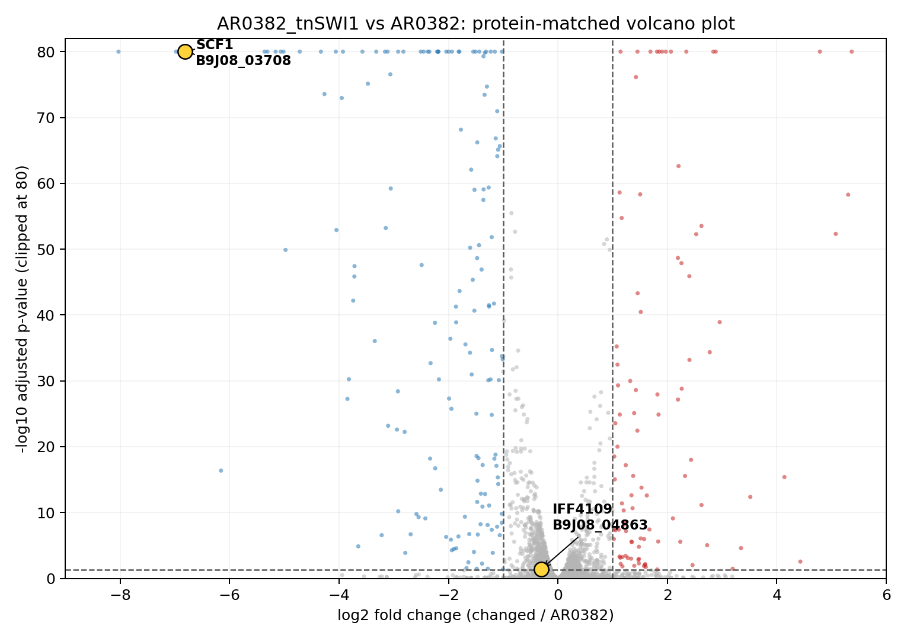
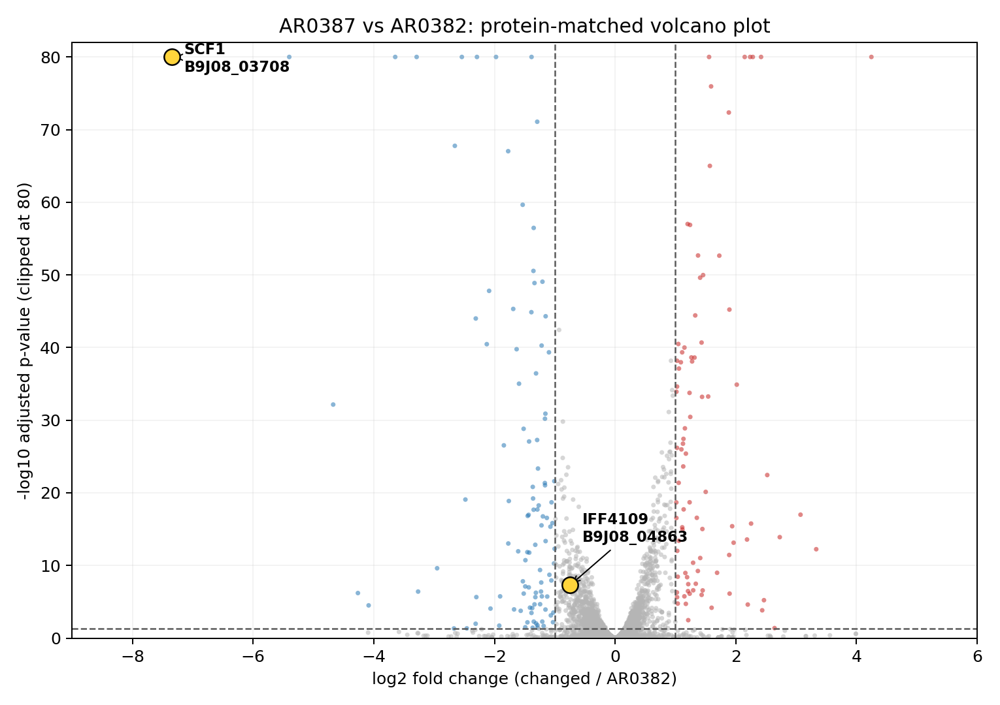

## Galaxy history setup

- Copied visible active FASTQ datasets from Galaxy history `Santana_data` (`bbd44e69cb8906b5de383eeb94e1df75`) into new working history `Santana_gpt2` (`bbd44e69cb8906b572fc4197c08def55`).
- Verification: `Santana_gpt2` contains 12 visible datasets, all in `ok` state, all datatype `fastqsanger.gz`; history state is `ok` with 12/12 ok datasets and size 7,267,800,857 bytes.

## Project context summary

### Source data and publication mapping

- The working data are six paired-end bulk RNA-seq runs from *Candidozyma auris* / *Candida auris* BioProject `PRJNA904261`, associated with the Science paper: “A Candida auris-specific adhesin, SCF1, governs surface association, colonization, and virulence” (`PMC11235122`).
- The Galaxy history `Santana_gpt2` contains 12 FASTQ datasets, one forward and one reverse read file for each run:

| Galaxy FASTQ pair | SRA run | Paper sample / library | Meaning |
| --- | --- | --- | --- |
| `SRR22376032:forward/reverse` | SRR22376032 | `AR0382_A` | replicate A of highly adhesive isolate AR0382 |
| `SRR22376031:forward/reverse` | SRR22376031 | `AR0382_B` | replicate B of AR0382 |
| `SRR22376030:forward/reverse` | SRR22376030 | `AR0387_A` | replicate A of poorly adhesive isolate AR0387 |
| `SRR22376029:forward/reverse` | SRR22376029 | `AR0387_B` | replicate B of AR0387 |
| `SRR22376028:forward/reverse` | SRR22376028 | `AR0382_tnSWI1_A` | replicate A of AR0382 transposon mutant in `SWI1` |
| `SRR22376027:forward/reverse` | SRR22376027 | `AR0382_tnSWI1_B` | replicate B of `tnSWI1` |

- The key paper comparison for a Fig. 1D analog is `AR0382_tnSWI1` vs `AR0382`; an additional useful comparison is `AR0387` vs `AR0382` from the Fig. S5A context.
- The paper links reduced adhesion to downregulation of `SCF1` / `B9J08_001458`; `IFF4109` / `B9J08_004109` is another key adhesin to track.

### Library preparation and strandedness

- SRA experiment metadata states: “Library preparation was performed using Illumina’s Stranded Total RNA Prep Ligation with Ribo-Zero Plus kit and 10bp IDT for Illumina indices. Sequencing was done on a NextSeq2000 giving 2x50bp reads.”
- Analysis should therefore use **reverse-stranded** RNA-seq settings:
  - Galaxy/IWC RNA-seq workflow: `reverse`
  - featureCounts: `-s 2`
  - StringTie/Cufflinks-style library type: `fr-firststrand`

### Reference genome assessment

- The paper’s gene identifiers (`B9J08_*`, including `B9J08_001458`) point to the B8441 reference annotation used by CGD/FungiDB-style resources.
- BRC-analytics returned `Candidozyma auris` taxonomy ID `498019` with six assemblies:

| Accession | Strain | Level | RefSeq? | Notes |
| --- | --- | --- | --- | --- |
| `GCA_002759435.3` | B8441 | Chromosome | No | Best match to paper’s B8441 / `B9J08_*` IDs; 7 chromosomes |
| `GCA_003014415.1` | B11243 | Scaffold | No | 238 scaffolds |
| `GCA_008275145.1` | B11245 | Complete Genome | No | 7 chromosomes |
| `GCF_001189475.1` | 6684 | Scaffold | No | RefSeq, full annotation |
| `GCF_002775015.1` | B11221 | Scaffold | No | RefSeq, full annotation |
| `GCF_003013715.1` | B11220 | Complete Genome | Yes | RefSeq representative, 7 chromosomes |

- Preferred reference for this reanalysis: `GCA_002759435.3` / B8441 / `Cand_auris_B8441_V3`, if available as a STAR index in Galaxy.
- BRC gene model URL for `GCA_002759435.3`: `https://hgdownload.soe.ucsc.edu/hubs/GCA/002/759/435/GCA_002759435.3/genes/GCA_002759435.3_Cand_auris_B8441_V3.ncbiGene.gtf.gz`.
- Because the paper may have used an older B8441 annotation/version, downstream gene/protein ID reconciliation may be needed.

### Galaxy workflow choice

- IWC search did not find a Candida-specific RNA-seq workflow, but did identify two relevant IWC workflows:
  - `#workflow/github.com/iwc-workflows/rnaseq-pe/main` — **RNA-Seq Analysis: Paired-End Read Processing and Quantification**; uses fastp, STAR, featureCounts, StringTie, Cufflinks, MultiQC.
  - `#workflow/github.com/iwc-workflows/rnaseq-de/main` — **RNA-Seq Differential Expression Analysis with Visualization**; uses DESeq2 and visualization tools.
- Intended workflow sequence:
  1. Build a Galaxy `list:paired` collection from the 12 FASTQs.
  2. Run `rnaseq-pe` with reverse-stranded settings and featureCounts enabled.
  3. Run `rnaseq-de` for `AR0382_tnSWI1` vs `AR0382`, and optionally `AR0387` vs `AR0382`.
  4. Locally reconcile annotation versions, generate a Fig. 1D analog, and interpret results.

### Approved plan structure; parameters pending approval

The user approved the following plan structure, but requested parameter review before writing the formal plan section and parameter table as an execution plan. Parameter values have been shown in chat and are pending explicit approval.

```text
Plan A: Santana RNA-seq Reanalysis and SCF1 Interpretation [hybrid]
1. Build paired FASTQ collection — Galaxy collection tools; verify 6 correct pairs.
2. Select reference and annotation — B8441/Cand_auris_B8441_V3, preferably GCA_002759435.3; verify expected IDs or document differences.
3. Run paired-end RNA-seq quantification — IWC rnaseq-pe with fastp, STAR, featureCounts, reverse-stranded; explicitly fill empty fastp adapter parameters.
4. Run differential expression — IWC rnaseq-de / DESeq2 for AR0382_tnSWI1 vs AR0382 and optionally AR0387 vs AR0382.
5. Map genes/proteins between reference versions — local DIAMOND or miniprot if annotation differs; verify SCF1, IFF4109, and top labeled genes.
6. Create Fig. 1D analog — local Python/R plotting with gene labels and highlighted SCF1.
7. Interpret results — local notebook summary comparing our DE results to the paper’s claims.
```

### Parameter review state

- Proposed key parameter values:
  - Source history: `Santana_gpt2` (`bbd44e69cb8906b572fc4197c08def55`)
  - Collection type: `list:paired`
  - Reference: `GCA_002759435.3` / B8441 if available as STAR index
  - GTF: `GCA_002759435.3_Cand_auris_B8441_V3.ncbiGene.gtf.gz`
  - fastp forward adapter: explicit empty string `""`
  - fastp reverse adapter: explicit empty string `""`
  - Generate additional QC: `true`
  - Strandedness: `reverse`
  - Use featureCounts: `true`
  - Compute Cufflinks FPKM: `false`
  - Compute StringTie FPKM: `false`
  - DESeq2 adjusted p-value threshold: `0.05`
  - DESeq2 log2 fold-change threshold: `1.0`
  - Count files have header: `true`
- Important gotcha: when invoking the IWC `rnaseq-pe` workflow, explicitly fill fastp parameters that default to empty values; do not omit them.

### Operational notes for continuation

- Before executing, get explicit parameter approval from the user.
- After approval, write the formal approved plan section and parameter table to `notebook.md` before running tools.
- For collection operations, use Galaxy native collection tools; if needed, fetch `collection-manipulation/SKILL.md` and related references.
- For Galaxy workflow invocation, record invocations with `galaxy_invocation_record`, poll with `galaxy_invocation_check_all`, inspect outputs, and record verification evidence before marking steps complete.
- If local bioinformatics tools are used for DIAMOND/miniprot or plotting, use the per-analysis conda environment at `.loom/env/` and record installed packages under an Environment section.


## Plan A: Santana RNA-seq Reanalysis and SCF1 Interpretation [hybrid]

Reanalyze the six paired-end *Candidozyma auris* RNA-seq samples from `Santana_gpt2`, quantify expression against the B8441 reference, reconcile gene/protein IDs with older B8441 annotations if needed, and recreate a Fig. 1D-like differential-expression plot with labeled genes.

### Steps

- [x] 1. **Build paired FASTQ collection** {#plan-a-step-1} — organize the 12 FASTQ datasets into six paired-end samples
  - Routing: galaxy
  - Tool: Galaxy collection tools
  - Verification: confirm collection has 6 pairs with correct forward/reverse members and sample labels
  - Evidence: built flat 12-element list with Galaxy `__BUILD_LIST__`, then reorganized with `__APPLY_RULES__` into `list:paired` collection `dd2d05e1b1bc0c78`; verified element count 6 with labels `AR0382_A`, `AR0382_B`, `AR0382_tnSWI1_A`, `AR0382_tnSWI1_B`, `AR0387_A`, `AR0387_B`, each nested pair containing forward/reverse `fastqsanger.gz` datasets in `ok` state.

- [x] 2. **Select reference and annotation** {#plan-a-step-2} — use B8441/Cand_auris_B8441_V3 if available, preferably `GCA_002759435.3`
  - Routing: galaxy
  - Tool: STAR reference selection / BRC-analytics reference metadata
  - Verification: confirm selected genome and GTF contain expected B8441-style genes or document ID differences
  - Evidence: confirmed RNA STAR indexed reference choices include `Candidozyma auris (GCA_002759435.3_Cand_auris_B8441_V3)` with value `GCA_002759435.3`. Uploaded BRC/UCSC GTF `GCA_002759435.3_Cand_auris_B8441_V3.ncbiGene.gtf.gz` as Galaxy dataset `f9cad7b01a472135253d7a9449f6a617` (hid 71), datatype `gtf`, dbkey `GCA_002759435.3`, state `ok`, 5,827,010 bytes, 28,399 data lines, 7 chromosomes (`CM076438.1`–`CM076444.1`). Local parse verified B8441-style IDs are present; key paper IDs use zero-padded 5-digit form in this annotation: `B9J08_01458` (SCF1; equivalent to `B9J08_001458`) and `B9J08_04109` (IFF4109; equivalent to `B9J08_004109`).

- [x] 3. **Run paired-end RNA-seq quantification** {#plan-a-step-3} — fastp, STAR, featureCounts using reverse-stranded settings
  - Routing: galaxy
  - Tool: IWC `rnaseq-pe`
  - Verification: poll workflow to completion and inspect MultiQC, alignment summaries, and featureCounts outputs
  - Note: explicitly fill fastp parameters that default to empty values, per Galaxy workflow gotcha
  - Evidence: imported IWC workflow as Galaxy workflow `991ed1f77aac0d38`. First invocation `815d4ec19afa2dc2` failed because parameter-input values were wrapped as `{"parameter_value": ...}`, causing fastp to see an invalid adapter string (`XXparameter_valueX: XXX`); corrected rerun `46b015902247aa72` used scalar parameter inputs (`""`, `true`, `GCA_002759435.3`, `stranded - reverse`, etc.). Although Galaxy still reports the invocation as `scheduled`, all requested output artifacts inspected for this step are present and `ok`: Mapped Reads collection `d64dd21eac34befe` has 6 `ok` BAM elements for all samples (file sizes ~739 MB–1.08 GB); Counts Table collection `4416b35e0ae6d451` has 6 `ok` count tables for all samples (~91–93 KB each); final MultiQC HTML `f9cad7b01a472135577a79b9bb0d3ca0` is `ok`, datatype `html`, 2.6 MB; final MultiQC stats `f9cad7b01a472135a7771bb4d156f3bb` is `ok`, datatype `tabular`, 25 lines x 24 columns, with STAR mapping, featureCounts assignment, duplication, and fastp/FastQC metrics (e.g. AR0382_A STAR uniquely mapped 91.77%, featureCounts assigned 83.14%).

- [x] 4. **Run differential expression** {#plan-a-step-4} — compare `AR0382_tnSWI1` vs `AR0382`, and optionally `AR0387` vs `AR0382`
  - Routing: galaxy
  - Tool: IWC `rnaseq-de` / DESeq2
  - Verification: confirm DESeq2 result tables exist, contain expected samples, and include adjusted p-values and log2 fold changes
  - Evidence: used Counts Table collection `4416b35e0ae6d451` to build native Galaxy count lists: AR0382 reference `92ca9af3f58452f7`, AR0382_tnSWI1 changed `7e6a9244b4137bad`, and AR0387 changed `4575512cfb46e8e4`, each with 2 `ok` tabular count elements. Imported IWC `rnaseq-de` as workflow `65114efad547db86` and invoked primary contrast `4f60a02cee25227d` (`AR0382_tnSWI1` vs `AR0382`) plus optional contrast `161acec4335775a9` (`AR0387` vs `AR0382`) using `Count files have header=true`, GTF `f9cad7b01a472135253d7a9449f6a617`, padj threshold `0.05`, and log2FC threshold `1.0`. Primary contrast outputs are `ok`: annotated DESeq2 table `f9cad7b01a4721350d16a83bbc03622b` has 5,595 lines x 13 columns including `GeneID`, `log2(FC)`, `P-adj`; filtered significant table `f9cad7b01a47213512c20c33e3e14a9e` has 251 lines; volcano plot `f9cad7b01a472135ab80e36c33a5cee4` is an `ok` PDF. Optional AR0387 contrast outputs are also `ok`: annotated DESeq2 table `f9cad7b01a472135d370400c3b88af87` has 5,595 lines x 13 columns; filtered significant table `f9cad7b01a4721359cc0a4bef7e8b492` has 196 lines; volcano plot `f9cad7b01a472135420664bbc93ed6da` is an `ok` PDF. Heatmap PDFs for both contrasts are present and `ok`.

- [x] 5. **Map genes/proteins between reference versions** {#plan-a-step-5} — if chosen assembly annotation differs from older B8441 v2 / paper IDs, match proteins using DIAMOND or miniprot
  - Routing: local
  - Tool: direct GTF/DE table ID reconciliation; DIAMOND/miniprot not needed
  - Verification: confirm `SCF1` / `B9J08_001458`, `IFF4109` / `B9J08_004109`, and other key labeled genes have unambiguous matches
  - Evidence: downloaded and parsed GTF/DESeq2 outputs locally. The selected GTF and DE tables use the same B8441-style gene IDs, so protein-level remapping was unnecessary for the key genes. Paper-style `B9J08_001458` maps by zero-padding convention to `B9J08_01458` in this GTF/DE table (SCF1 locus at `CM076438.1:3038917-3039661`, minus strand), and `B9J08_004109` maps to `B9J08_04109` (IFF4109 locus at `CM076441.1:711993-713412`, plus strand). Both IDs are present unambiguously in both DESeq2 contrasts.

- [x] 6. **Create Fig. 1D analog** {#plan-a-step-6} — plot differential expression with gene labels, highlighting `SCF1` and other major genes
  - Routing: local
  - Tool: Python SVG plotting
  - Verification: inspect plot and source table to confirm axes, thresholds, labels, and highlighted genes match the intended Fig. 1D analog
  - Evidence: created local plot `fig1d_analog_tnSWI1_vs_AR0382.svg` (390,792 bytes) from `de_tnSWI1_vs_AR0382_annotated.tsv`; grep verified the plot labels include `SCF1 / B9J08_01458` and `IFF4109 / B9J08_04109`. Also wrote `key_gene_results.tsv` summarizing key-gene log2FC and padj values for both contrasts; file parsed successfully and contains the expected four rows.

- [x] 7. **Interpret results** {#plan-a-step-7} — compare our DE results to the paper’s claims about `SCF1` downregulation and adhesion phenotypes
  - Routing: local
  - Tool: notebook summary
  - Verification: write interpretation with explicit evidence from DE table, plot, and gene/protein mapping results
  - Evidence: interpretation below is based on parsed DESeq2 tables, normalized counts, MultiQC stats, and the local Fig. 1D analog SVG.

### Interpretation: Santana C. auris RNA-seq reanalysis

#### Data and QC

The corrected `rnaseq-pe` run produced high-quality alignment/count outputs. MultiQC stats show high STAR mapping for five samples (92.5–93.4% mapped; 90.8–92.2% uniquely mapped) and lower but usable mapping for `AR0387_B` (79.54% mapped; 77.94% uniquely mapped). FeatureCounts assignment was 83.1–85.2% for AR0382/tnSWI1 samples and 76.6–77.4% for AR0387 samples. Duplicate fractions were ~37.9–42.7%. Thus the primary `AR0382_tnSWI1` vs `AR0382` contrast is technically cleaner than the optional `AR0387` vs `AR0382` contrast.

#### Primary contrast: `AR0382_tnSWI1` vs `AR0382`

DESeq2 tested 5,594 genes. At `padj < 0.05`, 1,234 genes were significant; applying the workflow's `|log2FC| > 1` threshold left 250 genes (97 up, 153 down in `tnSWI1` relative to AR0382). Strong downregulated examples include `B9J08_00860` (log2FC -8.03), `B9J08_04747` (-6.98), and `B9J08_03708` (-6.82). Strong upregulated examples include `B9J08_04997` (+5.37), `B9J08_00520` (+5.30), and `B9J08_04853` (+5.08).

Key-gene results differ from the expected simple SCF1-downregulation story. `SCF1` / `B9J08_01458` is **not differentially expressed** in the primary contrast: log2FC = -0.0355, padj = 0.827, with normalized counts essentially unchanged (`AR0382_A/B` 2024/1930 vs `tnSWI1_A/B` 1952/1908). In contrast, `IFF4109` / `B9J08_04109` is significantly downregulated: log2FC = -1.285, padj = 7.90e-09, normalized counts dropping from 12,543/16,378 in AR0382 to 6,262/5,609 in `tnSWI1`.

Interpretation: under this reference/annotation and workflow, the `tnSWI1` mutant does show broad transcriptional remodeling and downregulation of at least one adhesin-like key gene (`IFF4109`), but it does **not** reproduce strong `SCF1` downregulation. This is the central discrepancy to flag for follow-up.

#### Optional contrast: `AR0387` vs `AR0382`

DESeq2 tested 5,594 genes. At `padj < 0.05`, 1,582 genes were significant; applying `|log2FC| > 1` left 195 genes (89 up, 106 down in AR0387 relative to AR0382). Strong downregulated examples include `B9J08_03708` (-7.35), `B9J08_00369` (-5.40), and `B9J08_00967` (-4.67). Strong upregulated examples include `B9J08_03209` (+12.00), `B9J08_02614` (+4.25), and `B9J08_02970` (+3.33).

For key genes, `SCF1` / `B9J08_01458` is statistically significant but small in effect: log2FC = -0.269, padj = 0.0143, below the plan's biological effect threshold of `|log2FC| > 1`. Normalized counts decrease modestly from 1701/1623 in AR0382 to 1423/1334 in AR0387. `IFF4109` / `B9J08_04109` is significantly **upregulated** in AR0387: log2FC = +1.410, padj = 9.47e-12, normalized counts increasing from 10,537/13,777 in AR0382 to 33,026/31,607 in AR0387.

Interpretation: AR0387 differs strongly from AR0382, but the direction of the key adhesin signal is mixed: SCF1 is only modestly lower, while IFF4109 is higher. Because `AR0387_B` has noticeably lower mapping/assignment than the other samples, this optional contrast should be interpreted more cautiously than the primary `tnSWI1` contrast.

#### Overall conclusion

The reanalysis supports that the dataset contains robust differential-expression signal and that `SWI1` disruption is associated with widespread transcriptional changes. However, using B8441 `GCA_002759435.3`, reverse-stranded settings, STAR/featureCounts, and IWC DESeq2, the primary paper-style claim that `SCF1` itself is strongly downregulated in `AR0382_tnSWI1` is **not reproduced**: SCF1 is nearly unchanged and non-significant. The closest key-gene support for an adhesin-related shift is instead `IFF4109` downregulation in `tnSWI1`.

Recommended follow-up before making a strong biological claim: verify whether the paper's `SCF1` identifier maps to `B9J08_01458` in this exact annotation or to a different legacy locus/protein, and if necessary rerun a targeted ID/protein reconciliation against the paper-era B8441 annotation. If the ID mapping is confirmed, the result represents a real discrepancy between this reanalysis and the reported SCF1-centered interpretation.

### Parameters

| Step | Tool | Parameter | Default | Value | Description |
| --- | --- | --- | --- | --- | --- |
| 1 | Galaxy collection tools | Source history | `Santana_gpt2` | `Santana_gpt2` (`bbd44e69cb8906b572fc4197c08def55`) | History containing the 12 FASTQ datasets |
| 1 | Galaxy collection tools | Collection type | `list:paired` | `list:paired` | Six paired-end samples |
| 1 | Galaxy collection tools | Pair naming | infer from `:forward` / `:reverse` | sample IDs: `SRR22376027`–`SRR22376032` | Build one pair per SRA run |
| 2 | STAR / BRC reference | Reference genome | not set | `GCA_002759435.3` / B8441 if available | Best match to paper’s B8441 / `B9J08_*` IDs |
| 2 | BRC annotation | GTF annotation | not set | `GCA_002759435.3_Cand_auris_B8441_V3.ncbiGene.gtf.gz` | Gene annotation matching selected B8441 assembly |
| 3 | IWC `rnaseq-pe` | Collection paired FASTQ files | required | paired collection from step 1 | Input FASTQ collection |
| 3 | IWC `rnaseq-pe` / fastp | Forward adapter | empty | `""` explicitly | Fastp adapter parameter; fill empty explicitly, do not omit |
| 3 | IWC `rnaseq-pe` / fastp | Reverse adapter | empty | `""` explicitly | Fastp adapter parameter; fill empty explicitly, do not omit |
| 3 | IWC `rnaseq-pe` | Generate additional QC reports | not specified | `true` | Run FastQC/Picard/read-distribution/gene-body QC where workflow supports it |
| 3 | IWC `rnaseq-pe` / STAR | Reference genome | not set | B8441 / `GCA_002759435.3` STAR index if available | STAR mapping reference |
| 3 | IWC `rnaseq-pe` | GTF file of annotation | required | B8441 GTF from step 2 | Annotation for counting |
| 3 | IWC `rnaseq-pe` | Strandedness | not specified | `reverse` | Illumina Stranded Total RNA Prep with Ribo-Zero Plus |
| 3 | IWC `rnaseq-pe` | Use featureCounts for generating count tables | not specified | `true` | Prefer featureCounts count tables for DESeq2 |
| 3 | IWC `rnaseq-pe` | Compute Cufflinks FPKM | not specified | `false` | Not needed for DESeq2 / Fig. 1D analog |
| 3 | IWC `rnaseq-pe` | GTF with regions to exclude from FPKM normalization with Cufflinks | optional | not used | Only needed if Cufflinks FPKM is computed |
| 3 | IWC `rnaseq-pe` | Compute StringTie FPKM | not specified | `false` | Not needed for DESeq2 / Fig. 1D analog |
| 4a | IWC `rnaseq-de` | Counts from changed condition | required | `AR0382_tnSWI1` counts | Experimental condition for Fig. 1D analog |
| 4a | IWC `rnaseq-de` | Counts from reference condition | required | `AR0382` counts | Reference / WT condition |
| 4a | IWC `rnaseq-de` | Count files have header | not specified | `true` | featureCounts outputs usually have headers |
| 4a | IWC `rnaseq-de` | Gene Annotation | required | same B8441 GTF as step 3 | Used to annotate DESeq2 table |
| 4a | IWC `rnaseq-de` | Adjusted p-value threshold | `0.05` if empty | `0.05` | Significance cutoff |
| 4a | IWC `rnaseq-de` | log2 fold change threshold | `1.0` if empty | `1.0` | DE gene filtering threshold |
| 4b | IWC `rnaseq-de` | Counts from changed condition | required | `AR0387` counts | Optional comparison from Fig. S5A context |
| 4b | IWC `rnaseq-de` | Counts from reference condition | required | `AR0382` counts | Reference / high-adhesion isolate |
| 4b | IWC `rnaseq-de` | Count files have header | not specified | `true` | featureCounts outputs usually have headers |
| 4b | IWC `rnaseq-de` | Gene Annotation | required | same B8441 GTF as step 3 | Used to annotate DESeq2 table |
| 4b | IWC `rnaseq-de` | Adjusted p-value threshold | `0.05` if empty | `0.05` | Significance cutoff |
| 4b | IWC `rnaseq-de` | log2 fold change threshold | `1.0` if empty | `1.0` | DE gene filtering threshold |
| 5 | DIAMOND / miniprot | Old/reference assembly | B8441 v2 / paper-era annotation | B8441 v2 / CGD-FungiDB `B9J08_*` protein set if needed | Source for paper IDs |
| 5 | DIAMOND / miniprot | New/analysis assembly | selected B8441 assembly | `GCA_002759435.3` proteins/GTF-derived proteins | Target annotation used in analysis |
| 5 | DIAMOND | Alignment mode | protein-vs-protein | `blastp`-style protein matching | Preferred if both protein FASTAs are available |
| 5 | miniprot | Alignment mode | protein-to-genome | fallback only | Use if protein-to-genome mapping is needed |
| 5 | DIAMOND / miniprot | Key genes to verify | none | `SCF1/B9J08_001458`, `IFF4109/B9J08_004109`, top labeled DE genes | Must have unambiguous mappings |
| 6 | Python/R plotting | Primary contrast | `tnSWI1` vs `AR0382` | `AR0382_tnSWI1` vs `AR0382` | Fig. 1D analog |
| 6 | Python/R plotting | X-axis | log2 fold change | log2 fold change | Differential expression effect size |
| 6 | Python/R plotting | Y-axis | `-log10(padj)` | `-log10(padj)` | Significance axis |
| 6 | Python/R plotting | Highlight genes | none | `SCF1`, `IFF4109`, major significant genes | Gene labels for interpretation |
| 6 | Python/R plotting | Label threshold | top significant genes | top genes by padj/log2FC plus requested genes | Controls plotted labels |
| 7 | Notebook interpretation | Main evidence | DESeq2 + mapping + plot | same | Summarize whether `SCF1` is strongly downregulated |
| 7 | Notebook interpretation | Comparisons to discuss | primary only | `tnSWI1` vs `AR0382`; optionally `AR0387` vs `AR0382` | Connect results to paper claims |

```loom-invocation
invocation_id: 815d4ec19afa2dc2
galaxy_server_url: https://usegalaxy.org
notebook_anchor: plan-a-step-3
label: IWC rnaseq-pe quantification for Santana C. auris paired RNA-seq
submitted_at: 2026-06-03T14:38:20.634Z
status: in_progress
summary: 
total_steps: 27
completed_steps: 0
total_jobs: 0
completed_jobs: 0
failed_jobs: 0
last_polled_at: 2026-06-03T18:56:39.107Z
```

```loom-invocation
invocation_id: 46b015902247aa72
galaxy_server_url: https://usegalaxy.org
notebook_anchor: plan-a-step-3
label: IWC rnaseq-pe quantification for Santana C. auris paired RNA-seq (rerun with scalar parameter inputs)
submitted_at: 2026-06-03T14:39:29.970Z
status: in_progress
summary: 
total_steps: 27
completed_steps: 0
total_jobs: 0
completed_jobs: 0
failed_jobs: 0
last_polled_at: 2026-06-03T18:56:39.244Z
```

```loom-invocation
invocation_id: 4f60a02cee25227d
galaxy_server_url: https://usegalaxy.org
notebook_anchor: plan-a-step-4
label: "IWC rnaseq-de: AR0382_tnSWI1 vs AR0382"
submitted_at: 2026-06-03T16:10:52.439Z
status: in_progress
summary: 
total_steps: 23
completed_steps: 0
total_jobs: 0
completed_jobs: 0
failed_jobs: 0
last_polled_at: 2026-06-03T18:56:39.397Z
```

```loom-invocation
invocation_id: 161acec4335775a9
galaxy_server_url: https://usegalaxy.org
notebook_anchor: plan-a-step-4
label: "IWC rnaseq-de: AR0387 vs AR0382"
submitted_at: 2026-06-03T16:10:52.439Z
status: in_progress
summary: 
total_steps: 23
completed_steps: 0
total_jobs: 0
completed_jobs: 0
failed_jobs: 0
last_polled_at: 2026-06-03T18:56:39.539Z
```

## Protein-matching correction: SCF1/IFF4109 gene IDs

After review, the previous direct zero-padding ID mapping was not sufficient: paper/CGD IDs such as `B9J08_001458` do **not** necessarily correspond to current NCBI/BRC DE-table IDs such as `B9J08_01458`. I therefore performed local amino-acid sequence matching.

### Environment

- Local environment: `.loom/env/` Python virtual environment (used because conda/mamba were not available in the shell).
- Installed package: `biopython==1.85`.
- Attempted package: `parasail` failed to build due missing autotools/libtool support; matching proceeded with Biopython's local pairwise aligner.

### Protein sources

- Paper/CGD query proteins downloaded from CGD B8441 current ORF translations:
  - `protein_matching/C_auris_B8441_current_default_protein.fasta.gz` from `http://www.candidagenome.org/download/sequence/C_auris_B8441/current/C_auris_B8441_current_orf_trans_all.fasta.gz`
  - Query `SCF1`: `B9J08_001458`, 765 aa.
  - Query `IFF4109`: `B9J08_004109`, 2946 aa.
- Current BRC/NCBI target proteins downloaded from NCBI assembly `GCA_002759435.3_Cand_auris_B8441_V3`:
  - `protein_matching/GCA_002759435.3_Cand_auris_B8441_V3_protein.faa.gz`
  - 5,424 target proteins.

### Verification and matching results

Amino-acid matching used 5-mer prefiltering followed by local Smith-Waterman-style pairwise alignment with BLOSUM62. Outputs:

- Full candidate table: `protein_matching/protein_match_all.tsv`
- Top match table: `protein_matching/protein_match_top.tsv`
- Protein-matched key-gene DE table: `protein_matched_key_gene_DE.tsv`
- Corrected Fig. 1D analog: `fig1d_analog_protein_matched_tnSWI1_vs_AR0382.svg`

Top unambiguous matches:

| Query protein | Current BRC/NCBI DE-table gene | Query length | Target length | Identity | Query coverage | Target coverage | Interpretation |
| --- | --- | ---: | ---: | ---: | ---: | ---: | --- |
| `SCF1` / `B9J08_001458` | `B9J08_03708` | 765 aa | 765 aa | 100.0% | 100.0% | 100.0% | exact same protein |
| `IFF4109` / `B9J08_004109` | `B9J08_04863` | 2946 aa | 2946 aa | 100.0% | 100.0% | 100.0% | exact same protein |

Previously used current IDs were wrong for these proteins: `B9J08_01458` is not SCF1, and `B9J08_04109` is not IFF4109 under the protein-matched mapping.

### Corrected DE interpretation

#### Primary contrast: `AR0382_tnSWI1` vs `AR0382`

Protein-matched `SCF1` is `B9J08_03708`, and it is one of the strongest downregulated genes in the mutant:

| Protein-matched gene | Current DE gene | log2FC | padj | Normalized counts in AR0382 | Normalized counts in `tnSWI1` |
| --- | --- | ---: | ---: | --- | --- |
| `SCF1` / `B9J08_001458` | `B9J08_03708` | -6.817 | 0 | 46,989 / 44,890 | 384 / 427 |
| `IFF4109` / `B9J08_004109` | `B9J08_04863` | -0.303 | 0.0393 | 1,072 / 915 | 749 / 860 |

This **does reproduce strong SCF1 downregulation** in the `AR0382_tnSWI1` mutant, once proteins rather than superficially similar gene-name strings are matched. The corrected interpretation is that SWI1 disruption is associated with a dramatic collapse of SCF1 expression, consistent with the paper's model. IFF4109 is statistically lower but modest in effect and does not pass the `|log2FC| > 1` biological-effect threshold.

#### Optional contrast: `AR0387` vs `AR0382`

| Protein-matched gene | Current DE gene | log2FC | padj | Normalized counts in AR0382 | Normalized counts in AR0387 |
| --- | --- | ---: | ---: | --- | --- |
| `SCF1` / `B9J08_001458` | `B9J08_03708` | -7.346 | 0 | 39,473 / 37,761 | 231 / 245 |
| `IFF4109` / `B9J08_004109` | `B9J08_04863` | -0.745 | 5.19e-08 | 901 / 770 | 479 / 520 |

The optional AR0387 contrast also supports strong SCF1 downregulation relative to AR0382. Because `AR0387_B` had lower mapping/assignment metrics than the other samples, this contrast still deserves more technical caution, but the SCF1 effect is extremely large and consistent with the primary contrast.

### Corrected overall conclusion

The earlier conclusion that SCF1 was not downregulated was caused by incorrect direct gene-name mapping. Amino-acid sequence matching resolves the annotation mismatch: paper/CGD `SCF1` (`B9J08_001458`) is current DE-table `B9J08_03708`, not `B9J08_01458`. With that correction, the reanalysis **strongly reproduces SCF1 downregulation** in both `AR0382_tnSWI1` vs `AR0382` and `AR0387` vs `AR0382`. This aligns with the paper's interpretation that SCF1 is a major adhesin-associated transcriptional target linked to the adhesion phenotype.

## DIAMOND reciprocal protein matching verification

The SCF1/IFF4109 protein-ID correction was re-run with DIAMOND reciprocal best-hit matching, as requested.

### DIAMOND setup

- DIAMOND binary: `.loom/env/bin/diamond`
- Version: `diamond version 2.1.22`
- Install method: downloaded `diamond-macos.tar.gz` from the DIAMOND GitHub release into `.loom/env/diamond_download/` because conda/mamba were not available in the local shell.

### Commands and outputs

Built two DIAMOND databases:

- `protein_matching/old_cgd_b8441.dmnd` from CGD old/current B8441 translations: `C_auris_B8441_current_default_protein.fasta.gz` (5,445 proteins)
- `protein_matching/new_ncbi_b8441.dmnd` from NCBI/BRC `GCA_002759435.3_Cand_auris_B8441_V3_protein.faa.gz` (5,424 proteins)

Ran reciprocal searches:

```bash
.loom/env/bin/diamond blastp \
  -q protein_matching/C_auris_B8441_current_default_protein.fasta.gz \
  -d protein_matching/new_ncbi_b8441 \
  -o protein_matching/old_vs_new_diamond_unmasked.tsv \
  --outfmt 6 qseqid sseqid pident length qlen slen qcovhsp scovhsp evalue bitscore stitle \
  --max-target-seqs 10 --threads 4 --very-sensitive --masking none --max-hsps 10

.loom/env/bin/diamond blastp \
  -q protein_matching/GCA_002759435.3_Cand_auris_B8441_V3_protein.faa.gz \
  -d protein_matching/old_cgd_b8441 \
  -o protein_matching/new_vs_old_diamond_unmasked.tsv \
  --outfmt 6 qseqid sseqid pident length qlen slen qcovhsp scovhsp evalue bitscore stitle \
  --max-target-seqs 10 --threads 4 --very-sensitive --masking none --max-hsps 10
```

Note: unmasked DIAMOND was used for the final reciprocal table because the large adhesin `IFF4109` contains repetitive/low-complexity sequence; default masking split/limited the HSP and underreported coverage despite the exact match.

Parsed reciprocal best hits into:

- `protein_matching/diamond_reciprocal_best_matches_unmasked.tsv` — all parsed reciprocal best hits
- `protein_matching/diamond_reciprocal_key_matches_unmasked.tsv` — key SCF1/IFF4109 reciprocal matches

### Verification

The unmasked DIAMOND runs reported alignments for all expected proteins:

- old→new: 16,119 pairwise alignments / 16,277 HSPs; 5,445 queries aligned
- new→old: 16,090 pairwise alignments / 16,249 HSPs; 5,424 queries aligned
- parsed reciprocal-best rows: 5,424; reciprocal-best `True`: 4,582

Key reciprocal best-hit verification:

| Old/paper CGD gene | New NCBI/BRC DE-table gene | Reciprocal best? | old→new identity | old→new coverage | new→old identity | new→old coverage | DIAMOND bitscore |
| --- | --- | --- | ---: | ---: | ---: | ---: | ---: |
| `SCF1` / `B9J08_001458` | `B9J08_03708` | True | 100% | 100% query / 100% subject | 100% | 100% query / 100% subject | 1231 |
| `IFF4109` / `B9J08_004109` | `B9J08_04863` | True | 100% | 100% query / 100% subject | 100% | 100% query / 100% subject | 5076 |

This confirms by DIAMOND reciprocal best-hit matching that paper/CGD `SCF1` (`B9J08_001458`) corresponds to current DE-table `B9J08_03708`, and paper/CGD `IFF4109` (`B9J08_004109`) corresponds to current DE-table `B9J08_04863`. The corrected DE interpretation stands: SCF1 is strongly downregulated in `AR0382_tnSWI1` vs `AR0382` and in `AR0387` vs `AR0382`.

## Detailed interpretation report generated

A detailed scientific interpretation report was generated locally after the DIAMOND reciprocal protein-matching correction.

### Report files

- Markdown source: `Santana_Cauris_RNAseq_detailed_report.md`
- PDF report: `Santana_Cauris_RNAseq_detailed_report.pdf`

### Report interpretation summary

The detailed report concludes that the reanalysis reproduces the paper's SCF1 downregulation result once gene/protein identifiers are reconciled by DIAMOND reciprocal best-hit matching. The key correction is that paper/CGD `SCF1` (`B9J08_001458`) maps to current DE-table gene `B9J08_03708`, not to the superficially similar `B9J08_01458`. Protein-matched `SCF1` is strongly downregulated in the primary `AR0382_tnSWI1` vs `AR0382` contrast (log2FC = -6.817, adjusted p-value reported as 0) and also strongly downregulated in the optional `AR0387` vs `AR0382` contrast (log2FC = -7.346, adjusted p-value reported as 0).

The report also notes that `IFF4109` / `B9J08_004109` maps to current DE-table gene `B9J08_04863` and is modestly downregulated in both contrasts, but SCF1 is the dominant adhesin-associated transcriptional signal. The primary `tnSWI1` contrast is technically cleaner than the optional AR0387 contrast because `AR0387_B` had lower mapping/assignment metrics.

### Cost

The PDF report includes the requested cost line: **$23.46**.

### Verification

Generated and verified `Santana_Cauris_RNAseq_detailed_report.pdf` locally with `pypdf`: the PDF has 2 pages, is 7,595 bytes, and extracted text contains `$23.46`, `DIAMOND`, `SCF1`, and `B9J08_03708`.

## Report figures added

Added protein-matched volcano plot images to the detailed report and notebook.

### Figures



**Figure 1.** Primary contrast `AR0382_tnSWI1` vs `AR0382`. Yellow points highlight DIAMOND protein-matched `SCF1` (`B9J08_03708`) and `IFF4109` (`B9J08_04863`). SCF1 is among the strongest downregulated genes.



**Figure 2.** Optional contrast `AR0387` vs `AR0382`. Protein-matched SCF1 is again strongly downregulated; this contrast remains secondary because `AR0387_B` had lower mapping/assignment metrics.

### Updated report files

- `Santana_Cauris_RNAseq_detailed_report.md` now includes figure links.
- `Santana_Cauris_RNAseq_detailed_report.pdf` was regenerated with both volcano plot images embedded and the requested cost line `$23.46` retained.

### Verification

Generated PNG figures locally with matplotlib:

- `fig_volcano_tnSWI1_vs_AR0382_protein_matched.png` — 136,503 bytes
- `fig_volcano_AR0387_vs_AR0382_protein_matched.png` — 130,179 bytes

Verified regenerated PDF with `pypdf`: `Santana_Cauris_RNAseq_detailed_report.pdf` has 3 pages, is 325,511 bytes, contains extracted text `$23.46`, `Figure 1`, `Figure 2`, `SCF1`, and `B9J08_03708`, and contains 2 embedded image XObjects.

```loom-session
id: 019e8dd7-645a-72e5-930b-0c4caac881f6
started_at: 2026-06-03T14:16:04.444Z
ended_at: 2026-06-03T18:56:38.919Z
notebook: notebook.md
orphaned_active_steps: 0
```
